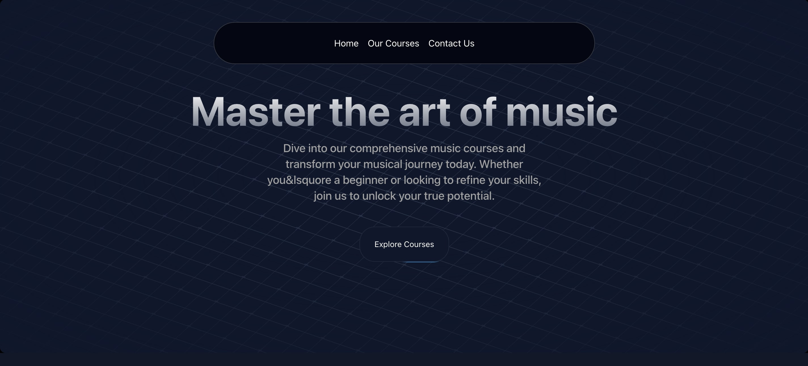
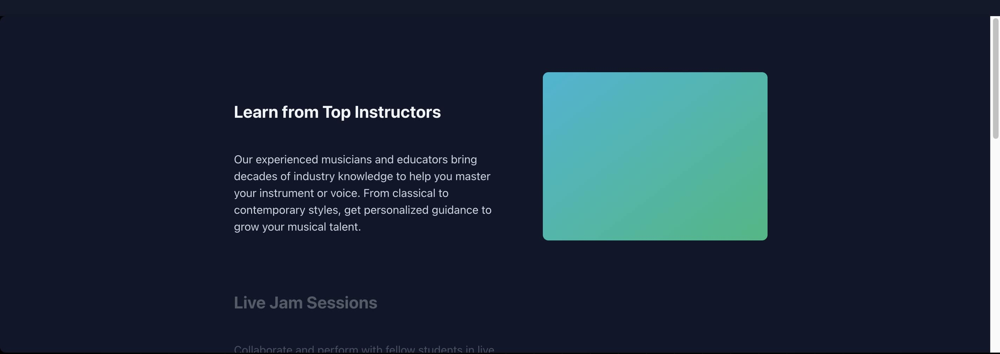
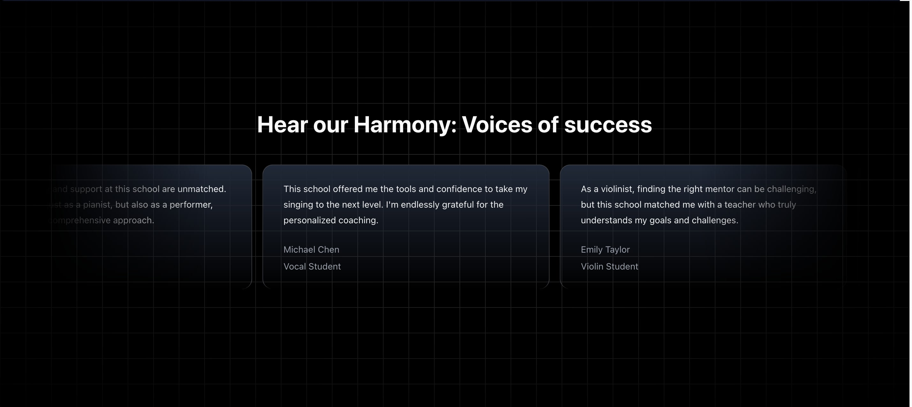
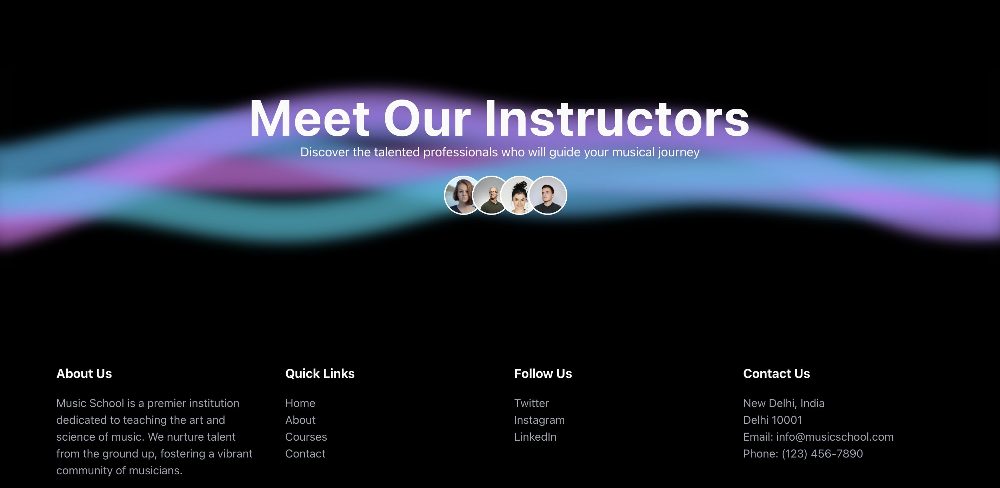
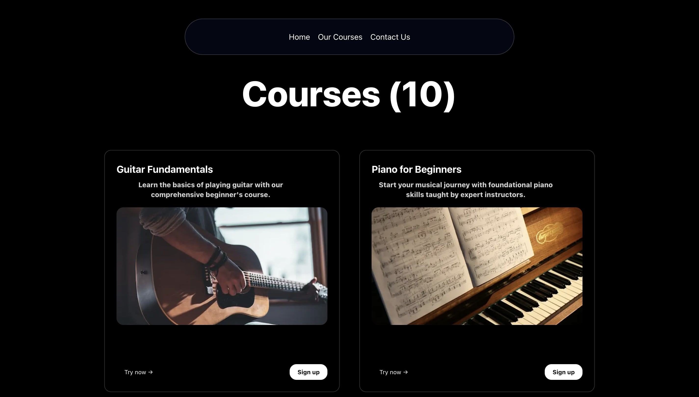
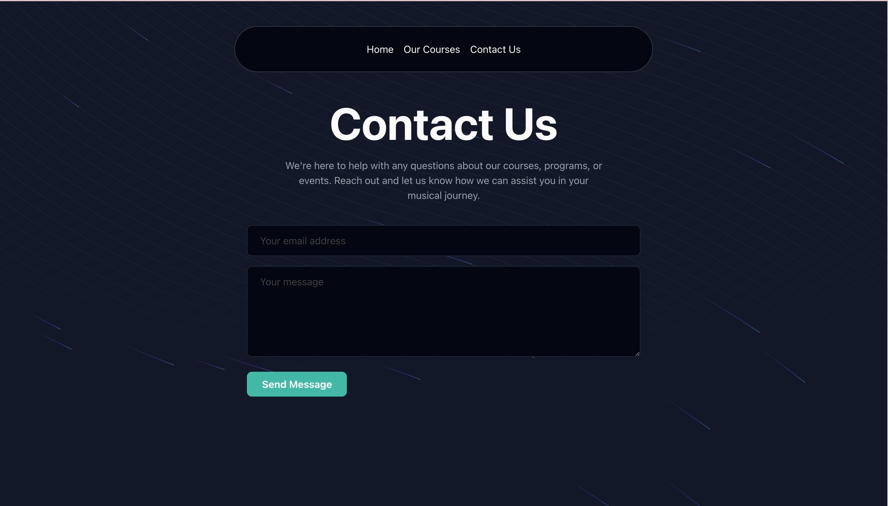

# 🎵 Music Academy UI – Built with Next.js & Aceternity UI

## Description

This is a Next.js project with primary focused on the UI elemtent. This project is built using UI library [Aceternity UI](https://ui.aceternity.com).

## Screenshots

### Hero Section



### Featured Courses


### Sticky Scroll



### Testimonial Section



### Instructor Section and Footer



### Courses Page



### Contact Page



## 🎥 [Video Demo](https://youtu.be/WZINW9YLxIw)

[](https://youtu.be/WZINW9YLxIw)

## ✨ Features

- Responsive hero section
- Sticky scroll effect for course sections
- Testimonial carousel
- Clean and modern UI using Aceternity UI
- Responsive and mobile-friendly layout

## 🛠️ Built With

- Next.js
- React.js
- Tailwind CSS
- Aceternity UI

## 🚀 Getting Started

First, run the development server:

```bash
npm run dev
# or
yarn dev
# or
pnpm dev
# or
bun dev
```

Open [http://localhost:3000](http://localhost:3000) with your browser to see the result.

You can start editing the page by modifying `app/page.tsx`. The page auto-updates as you edit the file.

This project uses [`next/font`](https://nextjs.org/docs/app/building-your-application/optimizing/fonts) to automatically optimize and load [Geist](https://vercel.com/font), a new font family for Vercel.

## 🙋‍♂️ Author

- Saumya Nayak – [@saumyarex](https://github.com/saumyarex)
